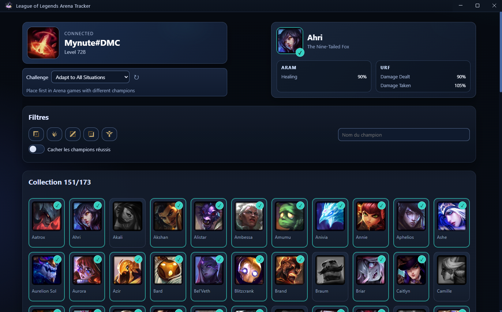

# League of Legends Challenge Tracker

Desktop Electron app to track challenges progression and champion viability in real time from League Client (LCU).



## Features

- Auto-detects League lockfile and connects to LCU
- Single app instance (focuses existing window on second launch)
- Summoner card with retry logic when launcher/client is unavailable
- Challenge selector with description and completion tracking
- Champion grid with search/position/hide-completed filters
- Selected champion side card with ARAM and URF modifiers
- Crowd favorite section from champ-select endpoint
- Automatic UI fallback on client close (`client-close` event)
- Window size and position persistence between launches

## Tech Stack

- Electron 42
- Vanilla HTML/CSS/JS (ES modules in renderer)
- WebSocket (`ws`) for LCU event stream
- electron-builder for Windows packaging

## Project Structure

- `app/main.js`: Electron bootstrap and IPC registration
- `app/preload.js`: secure renderer bridge (`window.electronAPI`)
- `app/main-process/window.js`: window creation and persisted bounds
- `app/main-process/lcu-handlers.js`: LCU connector lifecycle + IPC handlers
- `app/library/lcu-connect.js`: lockfile discovery, REST + WebSocket LCU client
- `static/index.html`: renderer entry HTML
- `static/styles.css`: global renderer styles
- `static/renderer.js`: renderer orchestration (state flow, listeners, retries)
- `static/renderer/config.js`: renderer constants
- `static/renderer/dom.js`: DOM node references
- `static/renderer/state.js`: shared renderer state
- `static/renderer/helpers.js`: normalization/formatting helpers
- `static/renderer/ui.js`: rendering primitives and UI interactions
- `static/assets/champions.json`: local champion dataset generated via [Meraki LoL Static Data](https://github.com/meraki-analytics/lolstaticdata)

## Prerequisites

- Node.js 18+
- League of Legends client installed (for LCU APIs)
- Windows (current packaging target)

## Install

```bash
npm install
```

## Run (dev)

```bash
npm start
```

## Build (Windows)

```bash
npm run build:win
```

## IPC Bridge (`window.electronAPI`)

Methods:

- `connectToClient()`
- `getSummonerData()`
- `getSummonerChallenges({ forceRefresh? })`
- `getCrowdFavorite()`

Events:

- `onChampSelectUpdate(callback)`
- `onChampSelectPick(callback)`
- `onChampSelectDisabledChamps(callback)`
- `onWebSocketConnected(callback)`
- `onWebSocketDisconnected(callback)`
- `onWebSocketError(callback)`
- `onClientClose(callback)`

## Runtime Flow (High Level)

1. App starts and renderer loads local champions dataset.
2. Renderer starts launcher retry loop.
3. Main process resolves lockfile path and connects to LCU.
4. Preload forwards IPC results/events to renderer.
5. Renderer refreshes summoner/challenges/crowd-favorites and updates selected champion card.
6. If lockfile disappears or client closes, main emits `lcu:client-close`; renderer resets to waiting mode.

## Notes

- Champions data source is local (`static/assets/champions.json`), no cache layer in renderer.
- ARAM/URF modifiers are derived from champion stats payload with project-specific formatting rules.
- `static/**/*` is included in packaging config.

## Troubleshooting

- If app cannot connect: verify League client is running and lockfile is accessible.
- If UI stays disconnected: wait for retry loop or relaunch League client.
- If build misses files: verify `build.files` in `package.json` still includes `app/**/*`, `static/**/*`, `package.json`.
