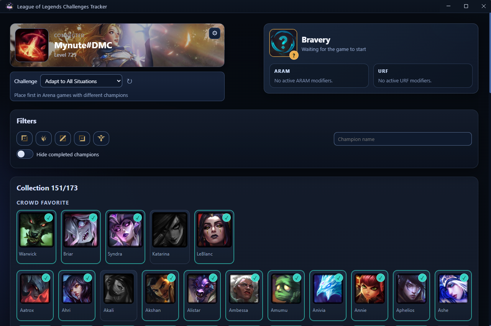

# League of Legends Challenges Tracker

Desktop Electron app to track challenge progression and champion viability in real time from League Client (LCU).

## Installation

1. Go to [latest Release](https://github.com/Mynute/LoL-Tracker/releases/latest)
2. Download Challenge-Tracker-Setup-X.X.X.exe
3. Process Installation

## Screenshots
*Idle Launcher*


*Arena Lobby - Crowd favorite*


## Features & Todo list

- [x] Auto-detects League lockfile and connects to LCU
- [x] Single app instance (focuses existing window on second launch)
- [x] Summoner card with retry logic when launcher/client is unavailable
- [x] Summoner ID tracking for session management
- [x] Settings gear in top-right of summoner card (version + updater + language toggle)
- [x] Challenge selector with description and completion tracking
- [x] Champion grid with search/position/hide-completed filters
- [x] Selected champion side card with ARAM and URF modifiers
- [x] Crowd favorite section from champ-select endpoint
- [x] Automatic champion update on game start event
- [x] Full internationalization (FR/EN) with language persistence
- [x] Automatic UI fallback on client close (`client-close` event)
- [x] Manual `Check for updates` action from renderer UI
- [x] Window size and position persistence between launches
- [x] Selected champion side card with ARENA spells modifiers
- [ ] Aram eligible section from champ-select endpoint
- [ ] Challenge selection persistence between launches
- [ ] Automatic Challenge Force Refresh (After Game or after a long timer)

## Tech Stack

- Electron 42
- Vanilla HTML/CSS/JS (ES modules in renderer) *Note: It's a personal choice for a small project framework would just slow me down*
- WebSocket (`ws`) for LCU event stream
- electron-builder for Windows packaging

## Project Structure

- `app/main.js`: Electron bootstrap and IPC registration
- `app/preload.js`: secure renderer bridge (`window.electronAPI`)
- `app/main-process/window.js`: window creation and persisted bounds
- `app/main-process/lcu-handlers.js`: LCU connector lifecycle + IPC handlers
- `app/library/lcu-connect.js`: lockfile discovery, REST + WebSocket LCU client
- `static/index.html`: renderer entry HTML
- `static/styles.css`: global renderer styles
- `static/renderer.js`: renderer orchestration (state flow, listeners, retries)
- `static/renderer/config.js`: renderer constants
- `static/renderer/dom.js`: DOM node references
- `static/renderer/state.js`: shared renderer state (summoner ID, champions, filters)
- `static/renderer/i18n.js`: internationalization (FR/EN) with language detection and persistence
- `static/renderer/helpers.js`: normalization/formatting helpers
- `static/renderer/ui.js`: rendering primitives and UI interactions
- `static/assets/champions.json`: local champion dataset generated via [Meraki LoL Static Data](https://github.com/meraki-analytics/lolstaticdata)

## Prerequisites

- Node.js 18+
- League of Legends client installed (for LCU APIs)
- Windows (current packaging target)

## Install

```bash
npm install
```

## Run (dev)

```bash
npm start
```

## Build (Windows)

```bash
npm run build:win
```

Publish artifacts (GitHub Releases):

```bash
npm run publish:win
```

## IPC Bridge (`window.electronAPI`)

Methods:

- `connectToClient()`
- `getSummonerData()`
- `getSummonerChallenges({ forceRefresh? })`
- `getCrowdFavorite()`
- `getAppVersion()`
- `checkForUpdates()`

Events:

- `onChampSelectUpdate(callback)`
- `onChampSelectPick(callback)`
- `onChampSelectDisabledChamps(callback)`
- `onWebSocketConnected(callback)`
- `onWebSocketDisconnected(callback)`
- `onWebSocketError(callback)`
- `onClientClose(callback)`
- `onUpdateStatus(callback)`
- `onGameStart(callback)` - triggered when game starts

## Runtime Flow (High Level)

1. App starts and renderer loads local champions dataset.
2. Renderer starts launcher retry loop.
3. Main process resolves lockfile path and connects to LCU.
4. Preload forwards IPC results/events to renderer.
5. Renderer refreshes summoner/challenges/crowd-favorites and updates selected champion card.
6. If lockfile disappears or client closes, main emits `lcu:client-close`; renderer resets to waiting mode.

## Auto Update

The app uses `electron-updater` in the main process.

Conditions for update check:

- App is packaged (`app.isPackaged`)
- App is not running as portable build
- `build.publish` is configured for GitHub Releases (already set to `Mynute/LoL-Tracker`)

To publish updates, define this environment variable:

- `GH_TOKEN`: GitHub token with permission to create/update release assets

Example:

```powershell
$env:GH_TOKEN="ghp_xxx"
npm run publish:win
```

Updater status values sent to renderer via `onUpdateStatus`:

- `checking`
- `update-available`
- `download-progress`
- `update-not-available`
- `update-downloaded`
- `error`

## Notes

- Champions data source is local (`static/assets/champions.json`), no cache layer in renderer.
- ARAM/URF modifiers are derived from champion stats payload with project-specific formatting rules.
- `static/**/*` is included in packaging config.

## Troubleshooting

- If app cannot connect: verify League client is running and lockfile is accessible.
- If UI stays disconnected: wait for retry loop or relaunch League client.
- If build misses files: verify `build.files` in `package.json` still includes `app/**/*`, `static/**/*`, `package.json`.
